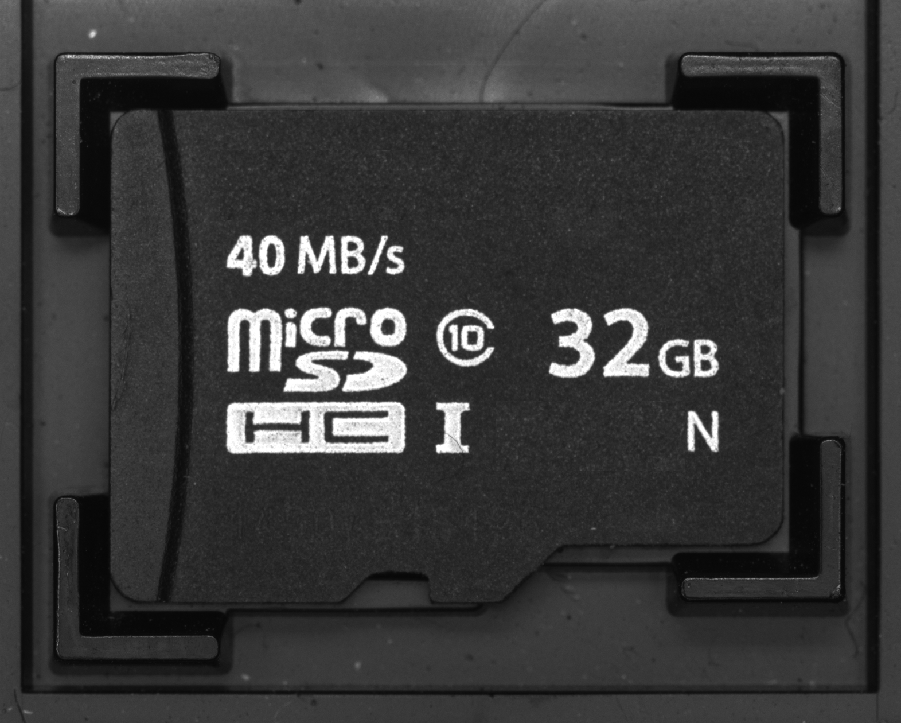

# ImageWatchPro for Visual Studio

[中文说明](README.zh-CN.md)

ImageWatchPro is a Visual Studio 2022/2026 debugger visualization extension for native C++ and OpenCV workflows. It helps you inspect `cv::Mat` images, masks, contours, geometry objects, numeric plots, histograms, and exported debug views while stopped at a breakpoint.


## Download

Download the latest VSIX from [GitHub Releases](https://github.com/namemzy/ImageWatchPro-for-VisualStudio/releases).

Current preview binary: `ImageWatchPro.Packaging.vsix`.

## What You Can Inspect

| Capability | Status |
| --- | --- |
| `cv::Mat` / `cv::Mat_<T>` image viewer | Available in the VSIX binary |
| Single-channel mask overlay | Available in the VSIX binary |
| OpenCV contours, point sets, rectangles, rotated rectangles | Available in the VSIX binary |
| Numeric line/scatter plots | Available in the VSIX binary |
| Grayscale and B/G/R channel histograms | Available in the VSIX binary |
| PNG/BMP/TIFF export with visible overlays | Available in the VSIX binary |

## Quick Start

1. Install Visual Studio 2022 or 2026 with native C++ workload.
2. Download `ImageWatchPro.Packaging.vsix` from Releases.
3. Close Visual Studio, run the VSIX installer, then reopen Visual Studio.
4. Start debugging a native C++ / OpenCV program.
5. Open `Debug > Windows > ImageWatchPro` while stopped at a breakpoint.
6. Use the `test-cpp/` project in this repository as the demo and smoke test.

## Demo / Smoke Test

The `test-cpp/` folder is both the public demo and the smoke-test project.

```powershell
cd test-cpp
cmake -S . -B build -G "Visual Studio 17 2022" -A x64
cmake --build build --config Debug
```

Set breakpoints near the marked return statements in `main.cpp`, then inspect the variables in ImageWatchPro.

## Screenshots

Real Visual Studio screenshots will be added here. For now, this repository includes the icon and the OpenCV demo images used by `test-cpp/`.

| Asset | Preview |
| --- | --- |
| Product icon |  |
| Demo image |  |
| Demo image |  |

## Open Source Scope

This repository contains public documentation, issue templates, and the `test-cpp/` demo/smoke-test project under the MIT license.

The current repository does not include the core extension source code. The core Visual Studio extension is distributed as a free binary VSIX through GitHub Releases.

## Feedback

Please use GitHub Issues for bugs, feature requests, compatibility reports, and documentation questions. Include your Visual Studio version, Windows version, OpenCV version, and a minimal repro when possible.
