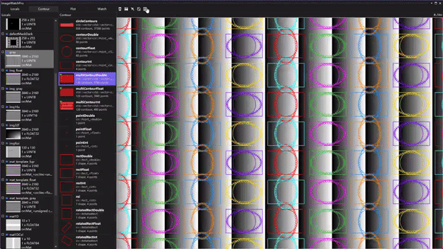

# ImageWatchPro for Visual Studio

[中文说明](README.zh-CN.md)

ImageWatchPro is a Visual Studio 2022/2026 debugger visualizer for native C++ and OpenCV. It upgrades the classic Image Watch workflow with mask overlays, contour and geometry inspection, numeric plots, histograms, and full-data export directly inside the Visual Studio debugger.

<p align="center">
  
  
  
</p>

<p align="center"><strong>Make OpenCV debugging visible, clear, and effortless.</strong></p>

## Why ImageWatchPro

If you write OpenCV C++ code, you have probably used `imshow`, `imwrite`, temporary files, or console dumps just to understand what happened inside a breakpoint. ImageWatchPro keeps that inspection loop inside Visual Studio:

- no temporary visualization code for every intermediate image
- no folder full of debug dumps
- no separate Python/Excel workflow just to inspect a vector or histogram
- image, mask, contour, point set, and export all share the same debugger viewport

## Download

Download the latest VSIX from [GitHub Releases](https://github.com/namemzy/ImageWatchPro-for-VisualStudio/releases).

Current preview binary: `ImageWatchPro.Packaging.vsix`.

## What You Can Inspect

- [x] `cv::Mat` / `cv::Mat_<T>` image viewer for 8U, 16U, 32F, grayscale, BGR/BGRA, and multi-channel data
- [x] Single-channel mask overlay with color and opacity controls
- [x] OpenCV contours, point sets, `cv::Point`, `cv::Rect`, and `cv::RotatedRect`
- [x] Numeric line, bar, and scatter plots from vectors, arrays, and 1D `cv::Mat`
- [x] Grayscale and B/G/R channel histograms
- [x] PNG/BMP/TIFF export with visible image, mask, contour, and point overlays
- [x] Original Image Watch-style Watch expressions, image operations, and Link Views workflow
- [x] Pin Panel layout for Locals / Contour / Plot / Watch side-by-side inspection

## Feature Tour

### Four-Panel Debugger Layout

ImageWatchPro separates the left panel into Locals, Contour, Plot, and Watch. You can keep the UI compact, or pin multiple panels side by side when a debugging session needs more context.


ImageWatchPro supports common OpenCV image formats out of the box:


### Mask Overlay

Single-channel images can be added as semi-transparent mask layers over the current image. This is useful for threshold results, defect regions, ROI checks, and segmentation debugging.


Multiple masks can be styled independently and toggled while keeping the base image visible.


Mask overlays can be exported together with the source image.


### Contours and Geometry

ImageWatchPro automatically captures OpenCV contour and geometry variables from the current stack frame, including `std::vector<cv::Point>`, `std::vector<std::vector<cv::Point>>`, `cv::Point`, `cv::Rect`, and `cv::RotatedRect` variants.


Integer contours align to pixel centers, while floating-point contours keep subpixel coordinates.


It also supports multi-contour overlay display and export to local storage.



Native OpenCV geometry objects can be visualized directly without converting them into drawing code first.


### Plot and Histogram

The Plot panel turns one-dimensional data into line, bar, or scatter charts directly from the debugger. Supported sources include `std::vector<int/float/double>`, `std::array`, fixed-size C arrays, and 1D single-channel `cv::Mat`.


Image histograms are available for grayscale images and independent B/G/R channels.


### Full-Data Export and Cleanup Controls

Export saves the full image data with visible mask, contour, and point overlays. It is not just a viewport crop.


The top toolbar lets you clear image, mask, contour, or everything independently.


## Compared With Other Tools

| Capability | Image Watch | HALCON Variable Inspect | ImageWatchPro |
| --- | --- | --- | --- |
| OpenCV image viewer | ✅ | ❌ | ✅ |
| Image operations / Watch expressions | ✅ | ❌ | ✅ |
| Mask overlay | ❌ | Region-oriented | ✅ |
| OpenCV contours and geometry | ❌ | XLD/Halcon objects | ✅ |
| Numeric plotting | ❌ | ❌ | ✅ |
| Histograms | ❌ | ❌ | ✅ |
| Full overlay export | Limited | ❌ | ✅ |
| Visual Studio 2022/2026 focus | Legacy | Halcon ecosystem | ✅ |

## Quick Start

1. Install Visual Studio 2022 or 2026 with the native C++ workload.
2. Download `ImageWatchPro.Packaging.vsix` from Releases.
3. Close Visual Studio, run the VSIX installer, then reopen Visual Studio.
4. Start debugging a native C++ / OpenCV program.
5. Open `Debug > Windows > ImageWatchPro` while stopped at a breakpoint.
6. Use the `test-cpp/` project in this repository as the demo and smoke test.


## Demo / Smoke Test

```powershell
cd test-cpp
cmake -S . -B build -G "Visual Studio 17 2022" -A x64
cmake --build build --config Debug
```

Set breakpoints near the marked return statements in `main.cpp`, then inspect the variables in ImageWatchPro.

## Who It Helps

- Computer vision engineers debugging detection, segmentation, matching, and measurement pipelines
- Industrial vision developers inspecting masks, contours, defects, and ROI logic
- OpenCV learners who want to see each intermediate result instead of guessing
- C++ engineers who need fast visual feedback without adding GUI/debug dumping code

## Support

Enjoying the extension? [Buy me a coffee](images/wechat-payment-QR-code.jpg) — every cup helps keep it free. Bug reports, suggestions, pull requests, compatibility reports, and documentation questions are welcome on [Github](https://github.com/namemzy/ImageWatchPro-for-VisualStudio). Please include your Visual Studio version, Windows version, OpenCV version, and a minimal repro when possible.

## Acknowledgements

ImageWatchPro is built on ideas and foundations from Microsoft's official [microsoft/image-watch](https://github.com/microsoft/image-watch) project. Thanks to Microsoft and the Image Watch contributors for creating the original Visual Studio image debugging workflow.

## License

This repository is licensed under the MIT License. See [LICENSE](LICENSE) for details.


## Follow

<p align="center">
  
</p>

Follow WeChat Official Account 「智启微观」 and send 「ImageWatchPro」 in the background to get the plugin download link, update notifications, usage tips, and technical articles.

