# ImageWatchPro for Visual Studio

ImageWatchPro 是一个面向 Visual Studio 2022/2026 的原生 C++ / OpenCV 调试可视化扩展。它在经典 Image Watch 的基础上，补齐了 Mask 叠加、轮廓/几何变量、数值绘图、直方图和合成导出等现代视觉调试能力。

<p align="center">
  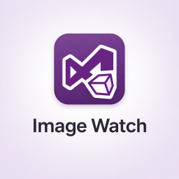
  
  
</p>

<p align="center"><strong>让 OpenCV 调试，看得见、看得清、看得爽。</strong></p>

## 为什么需要 ImageWatchPro

写 OpenCV 的 C++ 开发者，经常会在断点处想看中间结果：图像长什么样、Mask 是否覆盖正确、轮廓有没有偏、某个一维数组趋势对不对。

以前常见做法是加 `imshow`、写 `imwrite`、临时保存 CSV 再开 Python 或 Excel。ImageWatchPro 把这些调试动作收回到 Visual Studio 里：断点暂停后直接看图、叠 Mask、看轮廓、画曲线、查直方图、导出合成结果。

## 下载

请从 [GitHub Releases](https://github.com/namemzy/ImageWatchPro-for-VisualStudio/releases) 下载最新 VSIX。

当前预览版二进制文件名：`ImageWatchPro.Packaging.vsix`。

## 功能展示

- [x] `cv::Mat` / `cv::Mat_<T>` 图像查看，覆盖 8U、16U、32F、灰度、BGR/BGRA、多通道数据
- [x] 单通道图像作为 Mask 叠加，支持颜色和透明度调整
- [x] OpenCV 轮廓、点集、`cv::Point`、`cv::Rect`、`cv::RotatedRect` 可视化
- [x] 从 vector、array、裸数组和一维 `cv::Mat` 绘制折线图、柱状图和散点图
- [x] 单通道灰度直方图和 B/G/R 通道直方图
- [x] 合成可见图像、Mask、轮廓、点集并导出 PNG/BMP/TIFF
- [x] 兼容原版 Image Watch 的 Watch 表达式、图像操作和 Link Views 工作流
- [x] Locals / Contour / Plot / Watch 四面板 Pin Panel 并排查看

## 功能动图

### 四面板调试布局

ImageWatchPro 把左侧区域拆成 Locals、Contour、Plot、Watch 四个面板。默认保持紧凑，需要同时观察多类变量时，可以把面板 pin 成并排列。

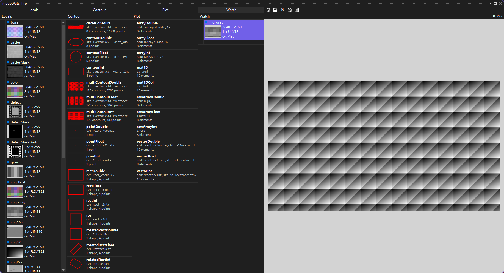

常见 OpenCV 图像类型可以直接显示：

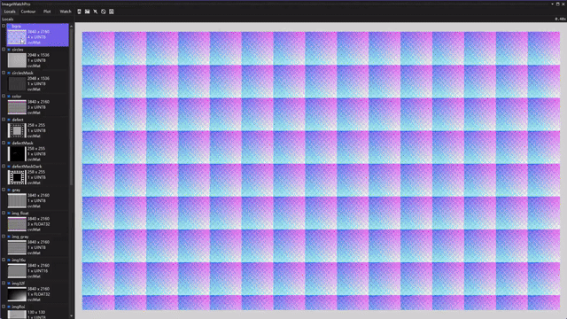

### Mask 叠加

单通道图像可以一键添加为半透明 Mask 层，适合查看阈值分割、缺陷区域、ROI 和语义分割等结果。

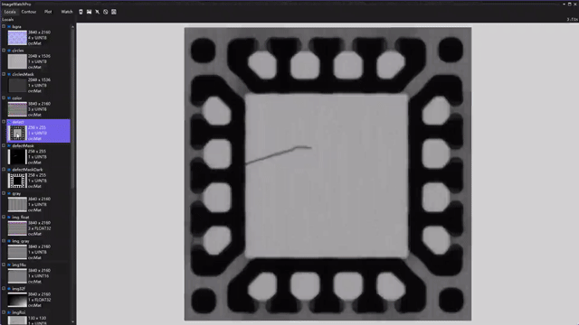

多个 Mask 可以分别调整颜色、透明度，也可以临时显示/隐藏。

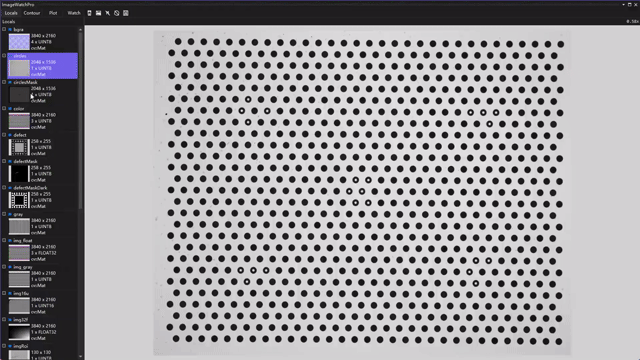

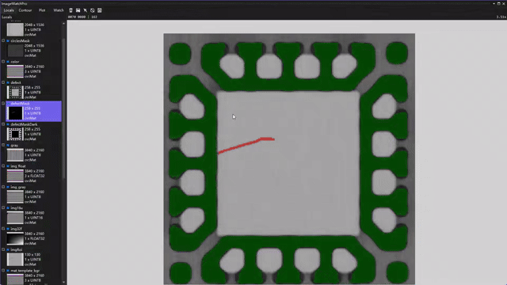

调试好的叠加结果可以连同底图一起导出。

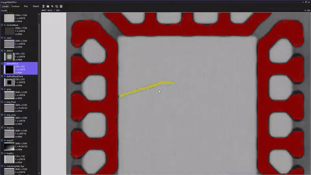

### 轮廓与几何变量

断点暂停时，ImageWatchPro 会自动捕获当前栈帧中的 OpenCV 轮廓和几何变量，例如 `std::vector<cv::Point>`、`std::vector<std::vector<cv::Point>>`、`cv::Point`、`cv::Rect` 和 `cv::RotatedRect`。


整数轮廓按像素中心显示，浮点/双精度轮廓保留原始亚像素坐标。多轮廓可自动循环配色，也可以切换为点集显示。


OpenCV 原生几何对象无需额外画图代码，也能直接查看。

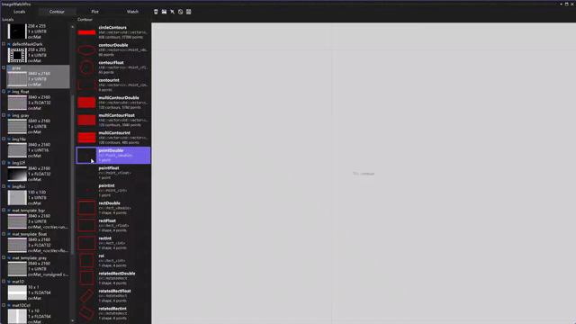

### Plot 与直方图

Plot 面板用于查看一维数值序列，支持 `std::vector<int/float/double>`、`std::array`、固定长度裸数组和一维单通道 `cv::Mat`。

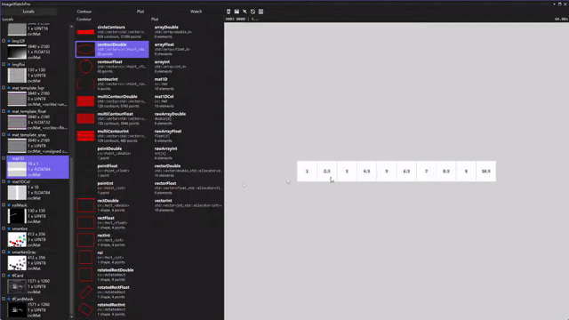

折线图、柱状图和散点图可以自由切换，并支持缩放、平移、坐标显示和 PNG 导出。

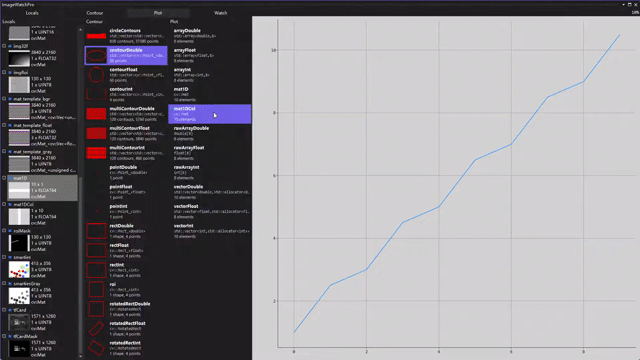

图像直方图支持单通道灰度图，也支持 B/G/R 三通道独立查看。

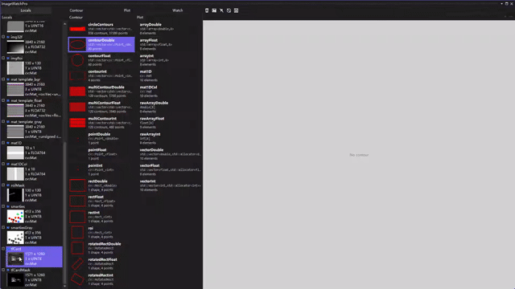

### 合成导出与逐项清除

导出保存的是完整图像数据，并合成当前可见的 Mask、轮廓和点集，不只是截取当前窗口。


顶部工具栏支持 Clear All、Clear Image、Clear Mask、Clear Contour 和 Export to File，方便按调试阶段逐项清理。


## 与其他工具对比

| 功能 | Image Watch 原版 | HALCON Variable Inspect | ImageWatchPro |
| --- | --- | --- | --- |
| OpenCV 图像变量可视化 | ✅ | ❌ | ✅ |
| 图像运算表达式 | ✅ | ❌ | ✅ |
| Mask 叠加 | ❌ | 偏 Region 工作流 | ✅ |
| OpenCV 轮廓/几何变量 | ❌ | XLD/Halcon 对象 | ✅ |
| 一维数据绘图 | ❌ | ❌ | ✅ |
| 直方图 | ❌ | ❌ | ✅ |
| 合成导出 | 有限 | ❌ | ✅ |
| 面向 VS2022/VS2026 | 旧版停更 | Halcon 生态 | ✅ |

## 快速开始

1. 安装 Visual Studio 2022 或 2026，并启用 C++ 桌面开发工作负载。
2. 从 Releases 下载 `ImageWatchPro.Packaging.vsix`。
3. 关闭 Visual Studio，运行 VSIX 安装器，然后重新打开 Visual Studio。
4. 启动一个原生 C++ / OpenCV 程序调试。
5. 在断点暂停后打开 `Debug > Windows > ImageWatchPro`。
6. 使用本仓库的 `test-cpp/` 作为 demo 和 smoke test。

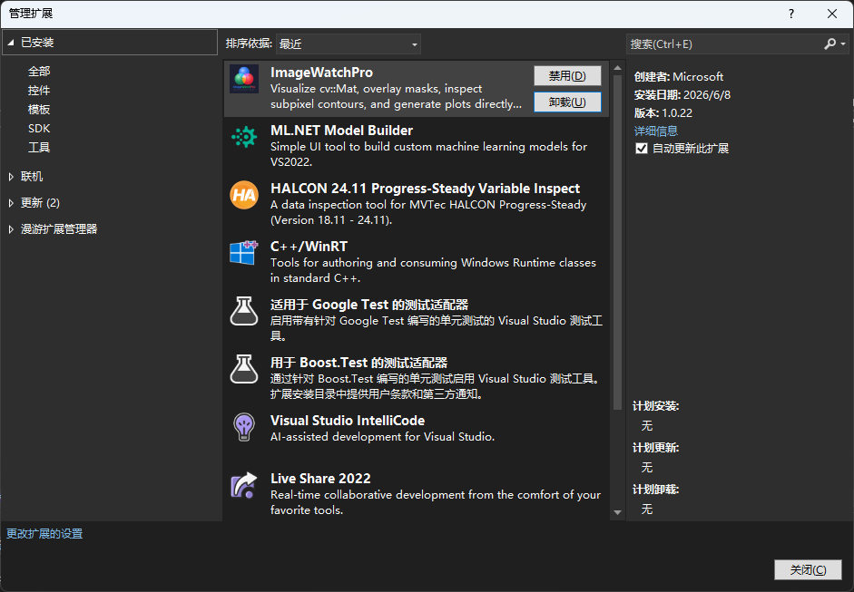

## Demo / Smoke Test

```powershell
cd test-cpp
cmake -S . -B build -G "Visual Studio 17 2022" -A x64
cmake --build build --config Debug
```

在 `main.cpp` 中带有“设置断点”提示的位置打断点，然后在 ImageWatchPro 窗口中查看变量。

## 适合哪些人

| 开发者类型 | 典型工作流 | ImageWatchPro 的价值 |
| --- | --- | --- |
| 计算机视觉工程师 | 目标检测、图像分割、特征匹配 | 图像 + Mask + 轮廓一站式查看 |
| 图像算法开发者 | 滤波、变换、增强、复原 | 中间结果即时对比，参数调优更快 |
| OpenCV 学习者 | 理解图像处理原理 | 可视化辅助理解每个函数的实际效果 |
| 工业视觉开发者 | AOI 缺陷检测、尺寸测量、定位引导 | 多 Mask 叠加 + 多轮廓标注 + 导出报告 |
| C++ 嵌入式视觉 | 边缘设备算法移植与调试 | 无需 GUI 框架，纯 VS 调试器内完成 |

## 支持项目

喜欢这个扩展？[请我喝杯咖啡](images/wechat-payment-QR-code.jpg)——每一杯都能帮助它持续免费。欢迎在 [GitHub](https://github.com/namemzy/ImageWatchPro-for-VisualStudio) 提交 Bug、建议、Pull Request、兼容性报告和文档问题。建议附带 Visual Studio 版本、Windows 版本、OpenCV 版本和最小复现代码。

## 致谢

ImageWatchPro 基于微软官方 [microsoft/image-watch](https://github.com/microsoft/image-watch) 项目的思路和基础继续增强。感谢 Microsoft 和 Image Watch 贡献者创建了最初的 Visual Studio 图像调试工作流。

## 开源协议

本仓库使用 MIT License。详情见 [LICENSE](LICENSE)。


## 关注公众号

<p align="center">
  
</p>

关注公众号「智启微观」，后台私信「ImageWatchPro」获取插件下载链接、更新通知、使用技巧和技术干货。

